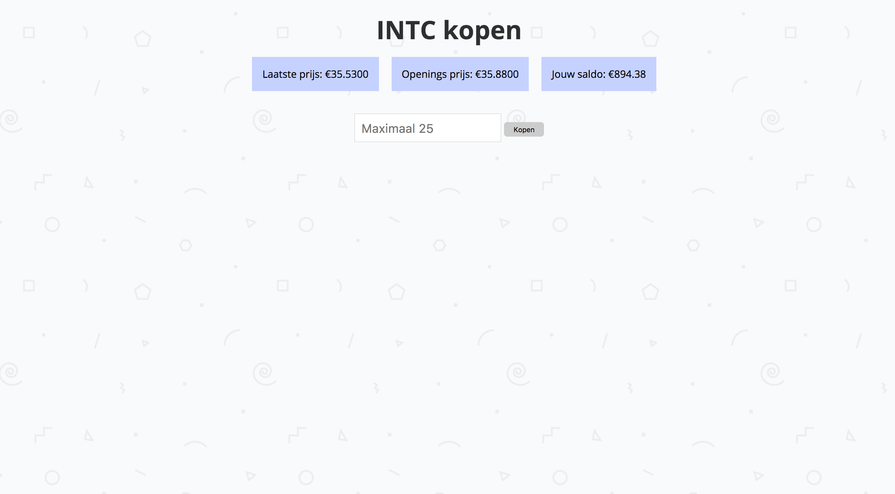

# StockedUp!
StockedUp! is a stock based game with the goal to make as much money as possible. The stocks you can buy are all Silicon Valley based company's. Each day the stock opens at 15:30 (Amsterdam Time). The game has a live view where you can see the latest rates.


Live version: [https://stockedup.herokuapp.com/](https://stockedup.herokuapp.com/)

## Usage
To use the game you have to login using Twitter. The first time you have to setup your account by filling in some information. After loggin in for the first time, you will recieve €100.000,-. You will see an empty portfolio after logging in for the first time. If you want to buy stock, click on the 'Overzicht' button. You will now see all available stocks.

To buy one of the stocks, simply click on the box with the name and logo of the stock you would like to buy. A new page will open with the latest price a.k.a. the price you are going to buy them for. In the input field you can see the max amount of stocks you can buy. After filling in the amount, simply press 'Kopen' to actually buy them. Now you will be redirected to your personal portfolio again.

To sell stocks, simply click the 'verkopen' button next to your portfolio. You can only sell all stocks of a company at once. By clicking 'Verkopen' the stocks will be sold and the money will be added to your saldo again.

To see all users and their saldo, click on the 'Bekijk alle users' button under the portfolio view.

## Features
- Login & create an account using Twitter oAuth
- Live view with the latest stock rates, updated every 5 seconds
- Buy and sell stocks to make more money
- Live portfolio view to see the profits or losses you've made
- Overview of other people's saldo

### Single features

***Check if user is logged in***
This check is fired at each page where you need to be logged in. It check's if there is a user session and, if so redirects you to the desired page.
```javascript
function checkForSession(req, res, next) {
    if (req.session.login) {
      res.locals.data = req.session.data;
      res.locals.user = req.session.user;
      next();
    } else {
      res.redirect('/account/login');
    }
  }
```

***oAuth callback***
This callback checks if the Twitter login was succesfull, if so a session will be created so that the user can visit all secret pages and perform al functionalities.

```javascript
router.get('/callback', function(req, res) {
  const config = {
    token: req.session.ReqToken,
    secret: req.session.ReqSecret,
    verify: req.query.oauth_verifier
  }
  /* GAIN TWITTER ACCESS
  --------------------------------------------------------------- */
  consumer.getOAuthAccessToken(config.token, config.secret, config.verify, function(error, token, secret, results) {
    if (error) {
      console.log(error);
    } else {
      req.session.oauthAccessToken = token;
      req.session.oauthAccessSecret = secret;
      req.session.login = true;
      res.redirect('/twitter');
    }
  });
});
```

***Connect to database and update stock information every 5 seconds***
This function connects to the MongoDB database. Every 5 seconds the latest stock information will be requested using the API. If there is a change on one of the stock values, this will be editted in the database. As well there will be a socket emit so that the live view will update it's actual value & rate.

```javascript
MongoClient.connect(dbConfig, (err, database) => {
  if (err) return console.log(err)
  db = database
  const collection = db.collection('stock');
  /* UPDATE STOCK DATA EVERY 1 MINUTE AND SAVE TO MONGODB
  --------------------------------------------------------------- */
  setInterval(function(){
    /* LOOP TROUGH ALL STOCKS AND COMPARE ACTUAL TO DB
    --------------------------------------------------------------- */
    allStocks.forEach(function(stock) {
      const url = `${process.env.STOCKAPIURL}${process.env.STOCKGLOBAL}symbol=${stock}${process.env.STOCKAPIKEY}`;
      /* REQUEST TO API FOR ACTUAL STOCK DATA FOR EACH STOCK
      --------------------------------------------------------------- */
      request(url, function (error, response, body) {
        let requestData = {};
        if(JSON.parse(body)) {
          requestData = JSON.parse(body)[process.env.MAIN];
        } else {
          requestData = {
            '03. Latest Price': 0,
            '07. Close (Previous Trading Day)': 0
          }
        }
        /* SEARCH FOR STOCK IN DATABASE
        --------------------------------------------------------------- */
        collection.findOne({
          ticker: stock
        }, function(err, ticker) {
          /* CHECK IF API RATE CORRESPONDS TO RATE IN DB
          --------------------------------------------------------------- */
          if (ticker.actual != requestData[process.env.LATEST]) {
            let lastValue = ticker.actual;
            const percentageChange = ((requestData[process.env.LATEST] - requestData[process.env.OPEN]) / requestData[process.env.OPEN]) * 100
            let dbData = {type: 'stock', ticker: stock, actual: requestData[process.env.LATEST], last: lastValue, open: requestData[process.env.OPEN], difference: percentageChange.toFixed(2)}
            /* UPDATE DB WITH NEWEST RATINGS IF SO
            --------------------------------------------------------------- */
            collection.update({ticker: stock}, dbData, {upsert:true}, function(err, doc) {
             io.emit('stock change', dbData)
             if (err) return res.send(500, {error: err});
            });
          }
        });
      });
    });
  }, 5000);
});
```

***Latest Portfolio Value's***
This function gets the latest stock values that are in a users portfolio. It creates an object that can be used in the view & emits a message to the socket so the changes are visible in the live view.
```javascript
function checkValue() {
    const collection = db.collection('stock');
    setInterval(function() {
      for (var key in portfolio) {
        collection.find({
          "ticker": portfolio[key].ticker
        }, function(err, singleStock) {
          singleStock.forEach(function(d) {
            /* IF ACTUAL PRICE IS NOT THE SAME AS PORTFOLIO PRICE, UPDATE AND EMIT TO SOCKET
            --------------------------------------------------------------- */
            if (portfolio[d.ticker].price != d.actual) {
              const difference = (((Number(d.actual) - (Number(portfolio[d.ticker].price)))) / Number(portfolio[d.ticker].price) * 100).toFixed(2)
              const newPrice = d.actual;
              const data = [d.ticker, newPrice, difference];
              io.emit('new price', data)
            }
          })
        });
      }
    }, 5000);
  }
```

## Screenshots

This is the overview with all stocks and their values. The percentage is the difference since the stock closed the day before


This is the overview with all stocks the user has. It has a live update function as well, so that you can see the latest rate every 5 seconds


This is the screen you see when you buy or sell stocks


The overview with all users and their actual saldo


The message you get to see as soon as your internet connection is down

## Used packages
* [x] [`Body-parser`](https://www.npmjs.com/package/body-parser) Middleware for body parsing
* [x] [`Dotenv`](https://www.npmjs.com/package/dotenv) Load enviroment variables from .env files
* [x] [`EJS`](https://www.npmjs.com/package/ejs) Templating library (Embedded JavaScript templates)
* [x] [`Express`](https://www.npmjs.com/package/express) Web framework for NodeJS (routing)
* [x] [`Express-session`](https://www.npmjs.com/package/express-session) Middleware for creating sessions
* [x] [`MongoDB`](https://www.npmjs.com/package/mongodb) Official MongoDB library for NodeJS
* [x] [`Request`](https://www.npmjs.com/package/request) Client for HTTP requests
* [x] [`Socket.io`](https://www.npmjs.com/package/socket.io) Enables websockets
* [x] [`Compression`](https://www.npmjs.com/package/socket.io) GZIP compression
* [x] [`Path`](https://www.npmjs.com/package/path) For using paths
* [x] [`oAuth`](https://www.npmjs.com/package/oauth) oAuth API for NodeJS
* [x] [`HTTP`](https://www.npmjs.com/package/socket.io) Package for HTTP servers

## Finished ToDo's
* [x] Enable oAuth for logging in with Twitter
* [x] Update all stock data every 5 minutes
* [x] First time profile setup
* [x] Portfolio view with live updates
* [x] Buy and sell stocks
* [x] Overview with all users & their saldo
* [x] Offline error when connection is down

## Wishlist
* [ ] D3 visualizations with intraday data
* [ ] Buy/Sell notifications the user can setup
* [ ] Add cryptocurrencies to the stocklist
* [ ] Weekly competition, the most earning user wins

## Setup instructions

### Clone the repository

```
  git clone https://github.com/camille500/RTW2.git
  cd RTW2
```

### Install all dependencies
```
npm install
```

### Add enviroment variables
Send me a message for the .env variables

### Start server
```
npm start
```

## Sources
- [Offline JS](http://github.hubspot.com/offline/docs/welcome/)
- [Stock API](http://www.alphavantage.co/)
- [Stock information](https://www.iex.nl/Koersen/Aandelen.aspx)

## License
MIT © Camille Sébastien Niessen
